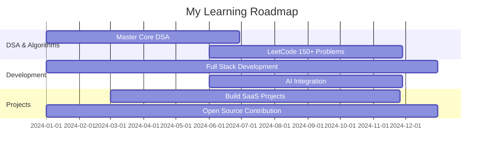

<!-- Welcome Animation -->
<div align="center">
  
  <h1>< Syed Ahmer Shah /></h1>
  <div align="center">
    
  </div>
</div>

<br>

<!-- Profile Views Counter -->
<div align="center">
  
  
  
  
  
</div>

<!-- Introduction -->
<h2 align="center">⚡ Transforming Ideas into Digital Reality ⚡</h2>

<div align="center">
  
</div>

<!-- About Me Section -->
## 🚀 About Me

```javascript
const ahmer = {
    pronouns: "He" | "Him",
    code: ["C++", "Java", "Python", "JavaScript"],
    askMeAbout: ["Web Dev", "Tech", "AI", "DSA", "OOP"],
    technologies: {
        frontEnd: {
            js: ["React", "Next.js"],
            css: ["Bootstrap", "Tailwind CSS"]
        },
        backEnd: {
            python: ["Django"],
            java: ["Spring Boot"]
        },
        databases: ["MongoDB", "MySQL"],
        tools: ["Git", "GitHub", "VS Code", "Cursor"]
    },
    currentFocus: "Building AI-Enhanced Web Applications",
    funFact: "I can turn coffee into code! ☕→💻"
};
```

<!-- Tech Stack Animation -->
<div align="center">
  
</div>

## 🛠️ Technology Arsenal

<table align="center">
  <tr>
    <td align="center" width="96">
      
      <br>C++
    </td>
    <td align="center" width="96">
      
      <br>Java
    </td>
    <td align="center" width="96">
      
      <br>Python
    </td>
    <td align="center" width="96">
      
      <br>JavaScript
    </td>
    <td align="center" width="96">
      
      <br>React
    </td>
  </tr>
  <tr>
    <td align="center" width="96">
      
      <br>GitHub
    </td>
    <td align="center" width="96">
      
      <br>MySQL
    </td>
    <td align="center" width="96">
      
      <br>Nginx
    </td>
    <td align="center" width="96">
      
      <br>TypeScript
    </td>
    <td align="center" width="96">
      
      <br>AWS
    </td>
  </tr>
</table>

<!-- GitHub Stats -->
## 📊 GitHub Analytics

<div align="center">
  
  
  
  
  
  
</div>

## 🎯 2028 Goals Roadmap

<div align="center">
  
</div>



## 🌟 Featured Projects

<div align="center">
  <a href="https://github.com/syedahmershah/Portfolio">
    
  </a>
</div>

<div align="center">
  <h3>Portfolio Tech Stack</h3>
  <p>
    
    
    
    
    
    
  </p>
  <p>
    <em>🤖 Fully developed using AI assistance for enhanced user experience and modern design</em>
  </p>
</div>

## 🔗 Connect & Collaborate

<div align="center">
  
</div>

<p align="center">
  <a href="https://medium.com/@syedahmershah">
    
  </a>
  <a href="https://dev.to/syedahmershah">
    
  </a>
  <a href="https://hashnode.com/@syedahmershah">
    
  </a>
  <a href="https://github.com/syedahmershah">
    
  </a>
  <a href="https://www.linkedin.com/in/ahmer-shah">
    
  </a>
  <a href="https://syedahmershah.github.io/Portfolio">
    
  </a>
</p>

<!-- Spotify Now Playing -->
<div align="center">
  
  [](https://open.spotify.com/user/syedahmershah)

</div>

<!-- Final Section -->
<div align="center">
  
  <br><br>
  <blockquote>
    <p align="center">
      <em>"Write code with logic, train models with precision & trust the divine architecture that powers it all"</em>
    </p>
    <p align="center">
      <em>- Ahmer Shah</em>
    </p>
  </blockquote>
</div>

---

<p align="center">
  <em>Thanks for dropping by! Let's build something legendary 🚀</em>
</p>

<p align="center">
  
</p>

<!-- Footer -->
<p align="center">
  <em>© 2025 Syed Ahmer Shah — All rights reserved.</em>
</p>